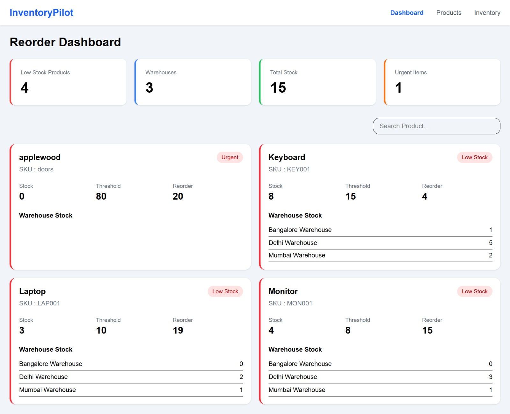
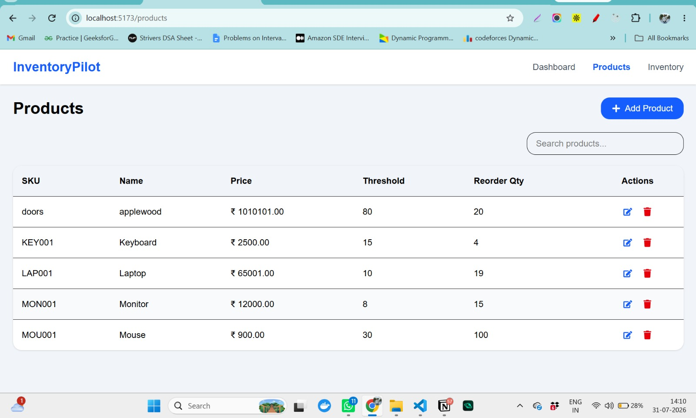
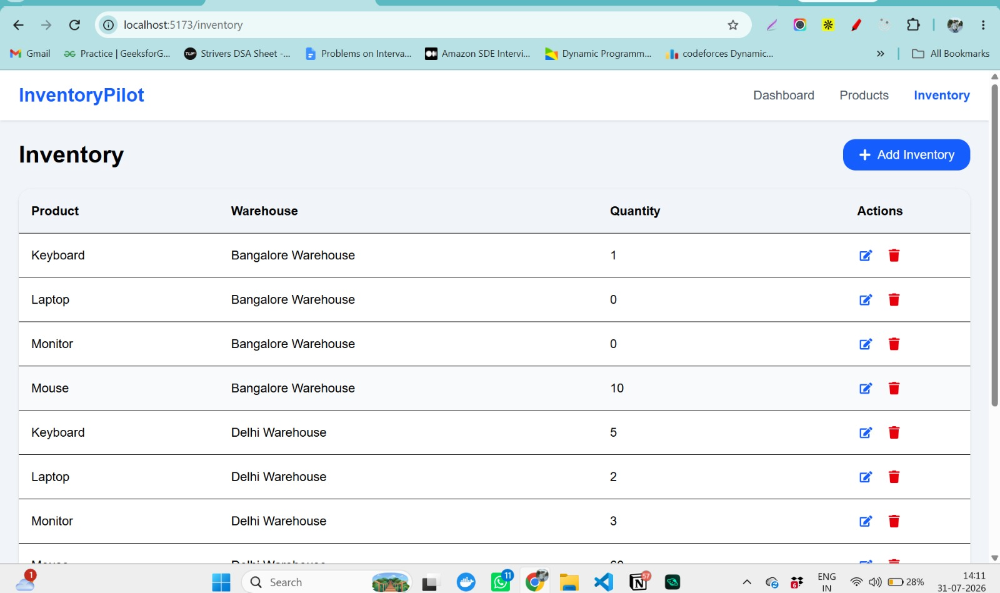

# InventoryPilot

InventoryPilot is a full-stack inventory management system built with Django REST Framework and React. It helps businesses manage products, warehouses, inventory, and identify products that require reordering based on stock thresholds.

## Features

- Product Management (CRUD)
- Warehouse Management (CRUD)
- Inventory Management (CRUD)
- Dashboard with stock overview
- Low stock detection
- Urgent reorder identification
- Product search
- Warehouse-wise inventory view
- Loading indicators
- Responsive UI
- Toast notifications

## Tech Stack

### Backend

- Django
- Django REST Framework
- PostgreSQL
- Python

### Frontend

- React (Vite)
- Tailwind CSS
- Axios
- React Router
- React Hot Toast
- React Icons

## Project Structure

```
InventoryPilot/
│
├── backend/
│   ├── apps/
│   │   ├── products/
│   │   ├── warehouses/
│   │   ├── inventory/
│   │   └── reorder/
│   ├── config/
│   └── manage.py
│
├── frontend/
│   ├── src/
│   │   ├── api/
│   │   ├── components/
│   │   ├── layouts/
│   │   ├── pages/
│   │   └── App.jsx
│   └── package.json
│
└── README.md
```

## Backend Setup

```bash
cd backend

python -m venv venv

# Windows
venv\Scripts\activate

pip install -r requirements.txt

python manage.py migrate

python manage.py seed_data

python manage.py runserver
```

## Frontend Setup

```bash
cd frontend

npm install

npm run dev
```

## API Endpoints

### Products

| Method | Endpoint |
|---------|----------|
| GET | /api/products/ |
| POST | /api/products/ |
| PUT | /api/products/{id}/ |
| DELETE | /api/products/{id}/ |

### Warehouses

| Method | Endpoint |
|---------|----------|
| GET | /api/warehouses/ |
| POST | /api/warehouses/ |
| PUT | /api/warehouses/{id}/ |
| DELETE | /api/warehouses/{id}/ |

### Inventory

| Method | Endpoint |
|---------|----------|
| GET | /api/inventory/ |
| POST | /api/inventory/ |
| PUT | /api/inventory/{id}/ |
| DELETE | /api/inventory/{id}/ |

### Dashboard

```
GET /api/dashboard/
GET /api/dashboard/?search=laptop
```

## Screenshots

### Dashboard



The dashboard provides an overview of inventory levels across warehouses and highlights products that require reordering based on the defined reorder threshold.

---

### Products



Manage products by adding, updating, deleting, and searching products. Each product includes SKU, price, reorder threshold, and reorder quantity.

---

### Inventory



Manage inventory for each product across multiple warehouses. Users can update stock quantities while maintaining a unique product-warehouse combination.

## Future Improvements

- Authentication
- Role-based access
- Pagination
- Warehouse filtering
- Export inventory reports
- Analytics dashboard

## Author

Nikhil Garg